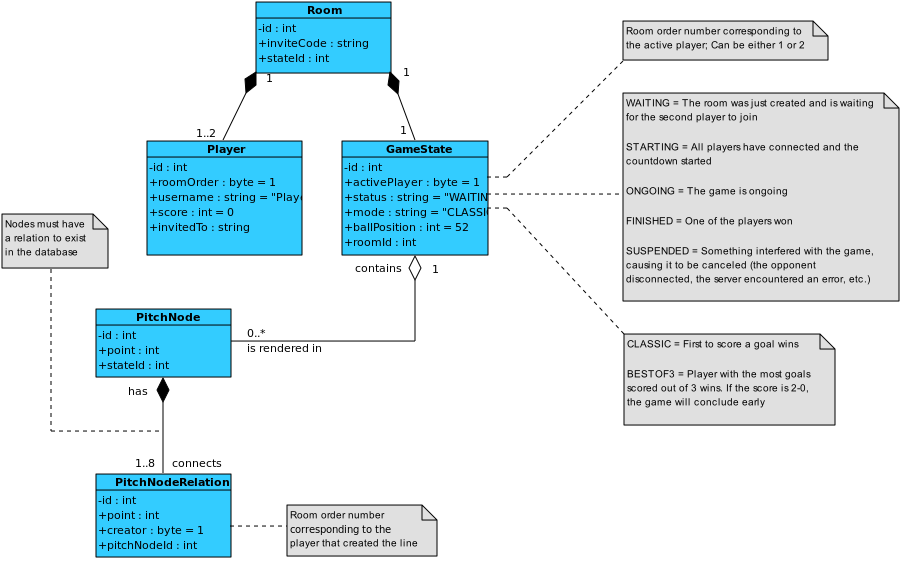

# Paper Soccer

"Paper soccer" is a web application game based on the 2-player, paper-and-pencil game with the same name. The setting of the game is a grid called "pitch", with two goalposts positioned west and east of the pitch.

## Motivation
I chose to pursue this project when I was playing some online social games with my friends (Skribbl, UNO, Haxball) and remembered this one pen-and-paper game I'd play in school during breaks: paper soccer. Upon research, I couldn't find many implementations of this idea online and I wanted a "paper soccer" app that would allow users to quickly create a match, play and move on, no bothersome authentication required. It's quite a niche and fun game, but at the same time it's easy to implement and perfect to practice my programming skills on, hence another reason why I pursued this project

## Gameplay
A dot (ball) will spawn in the middle of the pitch at the start of the game. In order to move the ball, players have to draw a 1-square long line per turn, straight or diagonal, relative to the ball. Players can get additional moves in one turn by "bouncing" the ball on the endpoints of lines created by previous moves or on the boundaries of the pitch. 

You can play the game in one of the two versions: singleplayer and multiplayer:
- **Singleplayer**: Get a feel of the game by practicing against the bot. No server connection required, all the gameplay logic exists in the browser
- **Multiplayer**: Give your friend an invite code that will be generated the moment you create a room and start playing

There are 2 game modes you can play:
- **Classic:** this is a very straight-forward mode: first to goal wins
- **Best of 3:** first to score the most goals wins; if 2 goals are scored by one of the players, the match will conclude early

The match will conclude in Classic if any of the following occur, while the end is determined solely by score in Best of 3:
- **Score a goal:** one player moves the ball inside the opponent's goalpost and wins; the scorer will get 1 score point in "best of 3"
- **Score an own goal:** one player moves the ball inside their own goalpost; the opponent will get 1 score point in "best of 3"
- **Get the ball stuck:** the ball is moved in a position that doesn't allow for any more moves, like a corner or running out of nodes to move towards; the opponent will get 1 score point in "best of 3"
- **Block the goalpost:** the access to one of the goalposts got blocked like [this](https://upload.wikimedia.org/wikipedia/commons/thumb/5/5d/Pi%C5%82karzyki_blokada_bramki.svg/800px-Pi%C5%82karzyki_blokada_bramki.svg.png); this event is very rare, but the app handles this case too; the blocker will get 1 score point in "best of 3"

## Mechanics 
- The pitch will be 8x10 with 2x1 goalposts 
- The ball will always spawn in the middle at the start of the game 
- Players can move in a straight or diagonal line once per turn for one square
- Bouncing: 
    - **Player bounce**: If the endpoint of a line intersects with an already drawn endpoint, the player can move for one more turn 
    - **Boundary bounce**: If the endpoint of a line intersects with the boundaries, the player can move for one more turn. Boundary bounces can only be done diagonally!
- Players can also cross already drawn lines to move diagonally, but it won't count as a bounce since the line didn't collide with an endpoint 

## Technologies
### Build tool and dev environment:
- Vite

### Front end
- React.js (UI components)
- TailwindCSS (styling)
- Redux Toolkit (state management)
- React Router (client side routing)
- Socket.io/client (web sockets)
- Howler.js (audio library)

### Back end
- Node.js (runtime environment)
- Express.js (server and RESTful API)
- Socket.io (web sockets)
- Prisma (database ORM - MySQL)

## Installation
1. Navigate to your directory of choice
2. Clone this repository: `git clone https://github.com/LiviuCocianu/paper-soccer.git`
3. Install the required packages:
    - Client: `cd paper-soccer && npm i`
    - Server: `cd ../paper-soccer-server && npm i`
4. Configure all the environment variables for client and server:
    1. Rename both `.env.example` files to `.env`
    2. Fill in the variables with your credentials
5. Navigate to server directory and run the database schema setup: `npx prisma db push`

## Usage
Run `npm run dev` for both the client and the server

## API

### Endpoints
Params marked with ? are optional, = represents the default value

| Object | HTTP Request | Endpoints | Action | Body | Query references
| :---: | :---: | --- | --- | --- | --- |
| Rooms | GET | /api/rooms | Get all rooms | | [1?, 2?](#query-params)
| | GET | /api/rooms/:id | Get one room by invite code |
| | POST | /api/rooms | Create one room | { &emsp;gameMode?: ["CLASSIC", "BESTOF3"]="CLASSIC" } |
| | PATCH | /api/rooms/:id | Update one room by invite code | Any column to update
| | DELETE | /api/rooms/:id | Delete one room by invite code |
| &nbsp;
| Players | GET | /api/players | Get all players | | [1?, 2?](#query-params)
| | GET | /api/players/:id | Get one player by invite code |
| | POST | /api/players | Create one player | { &emsp;id: string, &emsp;username: string, &emsp;invitedTo: string }   (id must be a [socket id](https://socket.io/docs/v3/server-socket-instance/#socketid)) |
| | PATCH | /api/players/:id | Update one player by ID | Any column to update
| | DELETE | /api/players/:id | Delete one player by ID. The room they were playing in will also be deleted if it gets empty |
| &nbsp;
| Game states | GET | /api/gameStates | Get all game states | | [1?, 2?](#query-params)
| | GET | /api/gameStates/:id | Get one state by invite code |
| | PATCH | /api/gameStates/:id | Update one state by invite code | Any column to update
| &nbsp;
| Pitch nodes | GET | /api/nodes | Get all pitch nodes | | [1?, 2?](#query-params)
| | GET | /api/nodes/:id | Get all pitch nodes by invite code | | [1?, 2?, 3?](#query-params)
| | POST | /api/nodes/:id | Create one node for game state by invite code | { &emsp;point: integer } |
| | DELETE | /api/nodes/:id | Delete all nodes by invite code | | [3?](#query-params)
| &nbsp;
| Pitch node relations | GET | /api/nodeRelations | Get all node relations | | [1?, 2?](#query-params)
| | GET | /api/nodeRelations/:id | Get all node relations for one node by point | | [1?, 2?, 4](#query-params)
| | POST | /api/nodeRelations/:id | Create one node relation for one node by ID | { &emsp;point: integer, &emsp;creator?: integer=1 } |
| | DELETE | /api/nodeRelations/:id | Delete all node relations for one node by ID |  | [3?](#query-params)

### Query params
| Index | Param | Type | Default | Limits | Description
| --- | --- | --- | --- | --- | --- |
| 1 | size | integer | SQL_SELECTION_LIMIT | Between 1 and SQL_SELECTION_LIMIT (see [.env.example](paper-soccer-server/.env.example)) | The amount of rows to return with this request
| 2 | page | integer | 1 | Starting with 1 | Used together with size. Page number of the paginated selected rows
| 3 | point | integer | | Between 0 and 104 (if pitch is 8x10 with 2x1 goal posts) | Index of the node on the pitch. For node relations, this is the location of the related node. See *diagram #1* on how point indexing works
| 4 | stateId | integer |  | Starting with 1 | Database ID for the game state the object belongs to

## Figures

1. Node indexing for the pitch

    
2. Database structure

    

## Appendix
- These [mockups](readme_assets/initial_mockups.pdf) were made in Photoshop and used as reference for creating the UI
- The following algorithm was designed and used for the bot movement:

    1. Consider neighboring points in all directions
    2. Exclude those that: 
        - are directly connected/related to the current point 
        - are out of bounds
  
    3. Choose a neighbor according to these priorities:
        1. Bounceable: Neighbors that have between 1 and 6 relations *(player-made relations; these are called "bounceable" points/neighbors)*
        2. Unbounceable: Neighbors with no connections
  

        If at least one bounceable point is found, unbounceable points will be excluded as candidates, no matter the validity 

        If there are two or more candidates with the same priority: 
            
        1. Measure the distance between all of them and the opponent's goalpost (use the Pythagorean theorem for calculating the distance)

        2. Choose the neighbor with the smallest distance 

            If two or more neighbors have the same distance, choose one at random 

    4. Create a `PitchNodeRelation` between the optimal node and the current node and viceversa
    5. Change `GameState.ballPosition` to the location of the optimal neighbor

        If a bounceable point was chosen, repeat all steps one more time
        
        Else, set the opponent's turn in `GameState.activePlayer`

## License
This project is available for use under the [MIT License](LICENSE.txt).